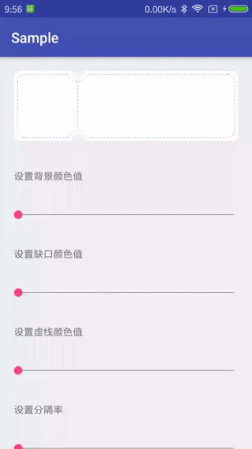

# Coupon

[](https://jitpack.io/#ShortStickBoy/Coupon)
[](http://www.apache.org/licenses/LICENSE-2.0.html)

### ScreenShot


### Gradle
```groovy
dependencies {
    compile 'com.github.ShortStickBoy:Coupon:V4.0.0'
}
```

### Use
```groovy
<com.sunzn.coupon.library.CouponView
    android:id="@+id/coupon_view"
    android:layout_width="match_parent"
    android:layout_height="100dp"
    android:layout_margin="20dp"
    android:background="@android:color/transparent"
    android:orientation="horizontal"
    app:cv_inner_dashed_blank="5"
    app:cv_inner_dashed_color="@android:color/holo_red_light"
    app:cv_inner_dashed_solid="5"
    app:cv_inner_divide_rates="0.285"
    app:cv_inner_holder_radius="10dp"
    app:cv_inner_margin_inter="10"
    app:cv_outer_circle_color="#F0F0F0"
    app:cv_outer_circle_radius="10dp"
    app:cv_outer_holder_color="@android:color/white"
    app:cv_outer_holder_radius="10dp" />
```

| Attribute              | Describe                                   | Additional                          |
| ---------------------- | ------------------------------------------ | ----------------------------------- |
| cv_outer_holder_radius | The radius of the outer round rect         | Support dimension and reference     |
| cv_outer_holder_color  | The Fill color of the outer round rect     | Support color                       |
| cv_outer_circle_radius | The radius of the outer notch circle       | Support dimension and reference     |
| cv_outer_circle_color  | The color of the outer notch circle        | Support color                       |
| cv_inner_margin_inter  | The gap between the inner and outer layers | Support float                       |
| cv_inner_holder_radius | The radius of the inner round rect         | Support dimension and reference     |
| cv_inner_dashed_color  | The dotted color                           | Support color                       |
| cv_inner_divide_rates  | Vertical dotted line segmentation rate     | The value is 0 to 1,default is 0.3F |
| cv_inner_dashed_solid  | The length of the solid line               | Default value is 5                  |
| cv_inner_dashed_blank  | Dotted length                              | Default value is 5                  |

### License
```
Copyright [2017-2018] sunzn

Licensed under the Apache License, Version 2.0 (the "License");
you may not use this file except in compliance with the License.
You may obtain a copy of the License at

   http://www.apache.org/licenses/LICENSE-2.0

Unless required by applicable law or agreed to in writing, software
distributed under the License is distributed on an "AS IS" BASIS,
WITHOUT WARRANTIES OR CONDITIONS OF ANY KIND, either express or implied.
See the License for the specific language governing permissions and
limitations under the License.
```